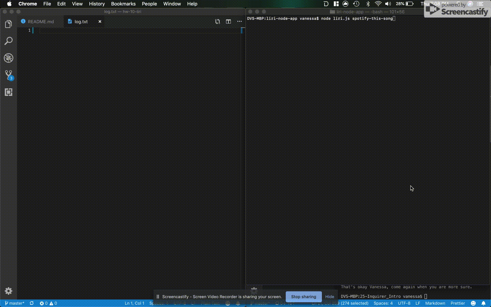

# **Liri Node App**

Liri is an imitation of Siri that uses Bands in Town API, Spotify API, and OMDB API. In the node runtime environment.

Here is a direct link that shows the execution of Liri [Vanessa de La Cuetara's Portfolio](http://delacue.com/portfolio/)

---

# **Motivation**

LIRI is like iPhone's SIRI. However, while SIRI is a Speech Interpretation and Recognition Interface, LIRI is a Language Interpretation and Recognition Interface. LIRI will be a command line node app that takes in parameters and gives you back data.

---

# **Technologies and Depencies**

This site runs in Node and therefore is written in **Javascript**

# _Core Dependencies/npm packages_ of the site:

> - `fs` - In addition to logging the data to your terminal/bash window, with this built-in dependency, the data is also outputted to a .txt file called log.txt. Each Command and response is appended to the log.txt file. This package is also used by LIRI to take the text inside of random.txt and then uses text in this file to call one of LIRI's commands.
> - \*\*axios` This node package to retrieve data from the OMDB API and Bands In Town API.
> - `node-spotify-api` This node package is used to retrieve song information from the Spotify API.
> - `moment` This node package takes the dates returned from the bands api and translates it into a readable format in this case; date will be displayed as "MM/DD/YYY".
> - `node-geocoder` This node package is used to get the exact location of the venue for the event returned by Bands In Town API. The reverse method from geocoder takes in a longitude and latitude and returns a formatted street address that is readable. 

# Features: _Liri Commands_ of the site used:

> - `concert-this` - follwed by an artist's name or band name will output to your terminal the next concert's venue, venue location, and date of event.
```
     * Name of the venue
     * Venue location
     * Date of the Event (using moment to format as "MM/DD/YYYY")
```

> - `spotify-this-song`- followed by the name of the a song will output to your terminal 5 results with artist(s) name, song name, a preview link of the song from spotify and the album the song came from.
```  
    * Artist(s)
    * The song's name
    * A preview link of the song from Spotify
    * The album that the song is from
```
* If no song is provided then your program will default to "The Sign" by Ace of Base.

> - `movie-this` followed by the name of the movie will output to your terminal 
```
       * Title of the movie.
       * Year the movie came out.
       * IMDB Rating of the movie.
       * Rotten Tomatoes Rating of the movie.
       * Country where the movie was produced.
       * Language of the movie.
       * Plot of the movie.
       * Actors in the movie.
```

* If the user doesn't type a movie in, the program will output data for the movie `Mr. Nobody.

> - `do-what-it-says` 
``` 
LIRI will take the text inside of random.txt and then use it to call one of LIRI's commands.
As is it will run `spotify-this-song` for "I Want it That Way,"
You can Edit the text in random.txt to test out the feature for movie-this and concert-this.
```

# **Code Example**
The responses use text art for the results, below is an example of the code used to execute the bands in town api and the logic needed to use multiple API's.
```js
var bandsInTownFn = function (searchTerm) {
    var queryURL = "https://rest.bandsintown.com/artists/" + searchTerm + "/events?app_id=codingbootcamp"
    
    axios.get(queryURL).then(
        function (response) {
            
            var r = response.data[0];
            //use moment to manipulate date
            var date = moment(r.datetime).format("MM/DD/YYYY");
            //To get address use reverse geocode and get longitude and latitude from bands in town response
            // store longitude and latitude in variables to use geocoder reverse lookup
            var venue = r.venue.name;
            var longitude = r.venue.longitude;
            var latitude = r.venue.latitude;
            var location = " ";
            geocoder.reverse({
                lat: latitude,
                lon: longitude
            }, function (err, res) {
                
                location = res[0].formattedAddress;
                var musicData = `
_¶¶¶¶_________________________¶¶_________________________________________________________
__¶¶¶¶¶_______________________¶¶_________________________________________________________
__¶¶__¶¶_____________________¶¶¶¶________________________________________________________
___¶¶__¶¶____________________¶¶¶¶¶_______________________________________________________
____¶¶_¶¶¶___________________¶¶__¶¶______________________________________________________
____¶¶_¶¶¶___________________¶¶__¶¶______________________________________________________
_____¶¶¶¶¶___________________¶¶_¶¶¶______________________________________________________
_____¶¶¶¶______________¶¶¶¶ ¶¶__¶¶_______________________________________________________
____¶¶¶¶_____________¶¶¶¶¶¶¶¶¶_¶¶________________________________________________________
___¶¶¶_¶¶__¶¶¶_______¶¶¶¶¶¶¶¶____________________________________________________________
__¶¶¶___¶¶¶¶¶¶¶¶¶_____¶¶¶¶¶¶_____________________________________________________________
_¶¶¶¶__¶¶¶¶___¶¶¶¶_______________________¶¶¶_____________________________________________
_¶¶¶__¶¶¶¶_¶¶¶__¶¶¶__________________¶¶¶¶¶¶______________________________________________
¶¶¶¶__¶¶¶¶¶¶¶¶¶__¶¶¶______________¶¶¶¶¶¶¶¶¶______________________________________________
_¶¶¶__¶¶¶_¶¶__¶__¶¶¶___________¶¶¶¶¶¶¶___¶¶______________________________________________
_¶¶¶¶__¶¶¶¶¶¶¶¶__¶¶________¶¶¶¶¶¶¶¶______¶¶______________________________________________
__¶¶¶¶____¶¶¶__¶¶¶______¶¶¶¶¶¶¶¶¶¶_______¶¶______________________________________________
___¶¶¶¶¶¶___¶¶¶¶¶_____¶¶¶¶¶¶¶¶___¶¶_______¶¶_____________________________________________
_____¶¶¶¶¶¶¶¶¶¶________¶¶¶¶¶_____¶¶___¶¶¶¶¶¶_____________________________________________
________¶¶¶_¶¶¶________¶¶________¶¶__¶¶¶¶¶¶¶_____________________________________________
_______¶¶¶¶¶_¶¶_______¶¶¶_____¶¶¶¶___¶¶¶¶¶_______________________________________________
_______¶¶¶___¶¶_________¶¶___¶¶¶¶¶¶______________________________________________________
_________¶¶¶¶¶__________¶¶___¶¶¶¶¶¶______________________________________________________
_________________________¶¶__¶¶¶¶________________________________________________________
_____________________¶¶¶¶¶¶______________________________________________________________
____________________¶¶¶¶¶¶¶______________________________________________________________
____________________¶¶¶¶¶¶_______________________________________________________________
_________________________________________________________________________________________
_________________CONCERT RESULTS FOR: ${searchTerm}
_________________________________________________________________________________________
_________________VENUE NAME: ${venue}
_________________________________________________________________________________________
_________________VENUE LOCATION: ${location}
_________________________________________________________________________________________
_________________DATE OF EVENT: ${date}
_________________________________________________________________________________________
`
                console.log(musicData);
                fs.appendFile("log.txt", musicData + divider, function(err) {
                    if (err) throw err;
                });
            })
        }).catch(function (error) {
            if (error.response) {
                console.log("Error", error.message);
            }
            console.log(error.config);
        });
}
```
# **GIF showing LIRI in use**
> - `LIRI in use` 

> - `LIRI default behavior` 

